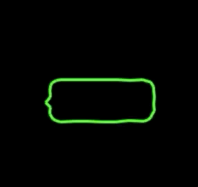

# speech box
generate a dynamic plotted speech box and draw to canvas,
originally prototyped in js/browser environment due to quicker feedback loop speed (no compile time) and intended for port to java/android environment to live as a custom view component.

